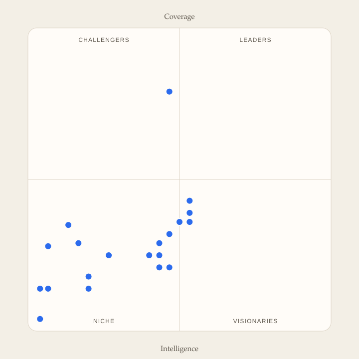

# Intelligence Scale

<p align="center">
  <a href="https://rodolphebarbanneau.github.io/intelligence-scale/">
    
  </a>
</p>

This project rates the AI products an organization can adopt — Cursor, Claude, Microsoft 365 Copilot, Sierra, and the rest. It does not rate which foundation model is smarter.

A product can sit on a strong model and still leave people doing every step. Another can take real work off a team's plate and still only serve one craft. The useful questions are **who gets the work done**, and **whose work fits on this product**. The [quadrant](docs/quadrant.md) is where those two answers meet.

The rated object is the **chassis**: the product a company can buy and run. The foundation model inside it is a separate question. A first-class wrap of another agent counts as this product exposes it, not as a copy of that agent's score. Customer counts, funding, and vendor size are not on the chart.

## Two axes

The horizontal axis is the [Intelligence Scale](docs/intelligence-scale.md). The vertical axis is the [Execution Scale](docs/execution-scale.md). A product can sit far along one and early on the other. That is not a failure of the other scale.

### Intelligence — who gets the work done?

Operational agency moves from people to AI in three stages.

- **Type I — Augmented.** People execute. AI assists. Humans still own the process. AI drafts, recommends, or completes bounded tasks.
- **Type II — Delegated.** AI executes. People supervise. A persistent AI worker can own a process over time. Humans set objectives, permissions, and exceptions.
- **Type III — Autonomous.** AI orchestrates. People govern. Operators coordinate the work among themselves. Human attention moves to purpose, policy, and irreversible decisions.

Left of center, people are still doing the work. Right of center, AI runs work on its own, started by triggers, with people supervising. At **2.0** and beyond, a persistent AI actor owns the process, not only a task inside it.

### Coverage — whose work fits?

This axis asks how far across the company the product can carry work as it ships, not how clever the model inside it is.

- A **craft tool** serves one specialist lane, such as writing code or editing video.
- A **function product** serves one business function, such as support or sales.
- A **company surface** is something several functions can put their own work on: shared work, systems of record, and a catalog that grows coverage.

A coding agent that can own an engineering change sits to the right and stays low. A company-wide assistant that only amplifies people sits high and stays left.

## The four quadrants

| Quadrant | Placement | What it means |
| --- | --- | --- |
| **Leaders** | Right and high | Agency can shift, and the product is a company surface, not a craft tool. |
| **Challengers** | Left and high | Company-wide, still human-operated. Many teams can put work on it. AI still assists rather than owns the process. |
| **Visionaries** | Right and low | Deep AI in one craft or function. Work can move toward AI inside a specialist lane. The rest of the company has no native path onto it. |
| **Niche** | Left and low | Thin on both scales. Limited agency shift, and limited organizational coverage. |

A company-wide chat assistant that people prompt step by step belongs with the Challengers. A workspace product where agents run on schedules and events across many teams belongs with the Leaders. A coding or support agent that carries its work end to end belongs with the Visionaries until other functions have a native path. A thin assistant or an unfinished prototype sits with Niche.

Each release asks several models to rate every product. The dot is the **median** of the scores that came back. The table ranks products by a **0–100 score**, the geometric mean of the two published axes, and also shows the spread so a single outlier stays visible.

## How a product is rated

The folder [`src/specs/`](src/specs/) holds one sourced dossier per product. A dossier describes what the product is and lists its features, preferring the official docs site. It does not contain a score.

A published release then rates every dossier with two open skills:

- the [type evaluator](src/skills/evaluate-type-scale/), from 0.0 to 3.0
- the [execution evaluator](src/skills/evaluate-exec-scale/), from 0.00 to 1.00

Models do not pick grades. Each one reads only the dossier, with no browsing, and answers the yes/no checks in the [type rubric](src/type.yaml) and the [execution rubric](src/exec.yaml), quoting the dossier for every check it passes. The scorer in [`cli/rating/`](cli/rating/) rejects quotes it cannot find, derives each grade from the checks, applies the caps and gates, and computes both scores. Every model sees the same evidence, so runs can be compared.

The evaluators are conservative. A fact the dossier does not state fails its check. Marketing language passes nothing. They rate the chassis, not the model, and they grade a wrap by what this product surfaces and adds.

Someone who represents that product can correct a factual error in their own dossier. The next release reads the correction and rates the product again.

## Run it locally

Ratings run through [OpenRouter](https://openrouter.ai/), so any model it lists can rate. Install [uv](https://docs.astral.sh/uv/), copy [`.env`](.env.example) to `.env.local`, and put your key there. An exported `OPENROUTER_API_KEY` still wins over the file.

```sh
uv run intelligence-scale run --spec cursor --model x-ai/grok-4.7
```

Every Python tool in this repository is a command of that one CLI, under [`cli/`](cli/). Run `uv run intelligence-scale --help`, or `--help` after any command, for the full list of options.

A run without `--run-id` gets a `test-` id. It writes `output/test-…/` and stays out of the published index. Useful options:

- `--samples 3` asks each model three times and keeps a check only when most samples pass it.
- `--max-cost 5` stops starting new calls after five US dollars.
- `--dry-run` swaps the model for a stand-in that fails every check, with no key and no cost.

Other commands:

- `calibrate --run-id <id>` compares a run of the anchor specs (`run --anchors`) with the expected grades in [`src/config/reference.json`](src/config/reference.json) and reports agreement between models.
- `aggregate --run-id <id>` rebuilds `output/<id>/` from the partials in `temp/<id>/`.
- `score answer.json --axis type --spec <slug>` scores check answers written by hand or by another assistant.
- `render-rubrics` writes the rubrics into the evaluator skills. `self-check` runs the built-in checks.
- `quadrant` renders a run as a quadrant SVG. `serve` browses the report locally.
- `mock` writes the one-model fixture run that the calibration anchors come from.

The GitHub workflow runs the same CLI. Publishing a release rates every published spec with the models in [`src/config/models.txt`](src/config/models.txt) and commits the output. A manual run can rate a subset in test mode, or calibrate, without committing anything.

## Docs

- [The Intelligence Scale](docs/intelligence-scale.md) — Type I Augmented, Type II Delegated, and Type III Autonomous.
- [The Execution Scale](docs/execution-scale.md) — domain span, shared work, system reach, extensible coverage, work surfaces, adoption path, and ready-made jobs.
- [The quadrant](docs/quadrant.md) — how the two scores become a chart, and what each quadrant means.

## Skills

Open skills live in this repository.

- [Create spec](src/skills/create-spec/) writes a sourced dossier and does not rate the product.
- [Evaluate type scale](src/skills/evaluate-type-scale/) rates the chassis on how far operational agency can shift from people to AI.
- [Evaluate exec scale](src/skills/evaluate-exec-scale/) rates the chassis on how much of a company's work the product can carry as it ships.

## The report

The [report](https://rodolphebarbanneau.github.io/intelligence-scale/) shows the quadrant, the spread of scores across models, and each model's written analysis. Earlier releases stay selectable. To browse a local checkout, run `uv run intelligence-scale serve`.

## Contributing

See [CONTRIBUTORS.md](CONTRIBUTORS.md).

Project contributors change the scales, the skills, and the report. Spec representatives may ask for corrections to factual errors in their own dossier and do not set scores.
